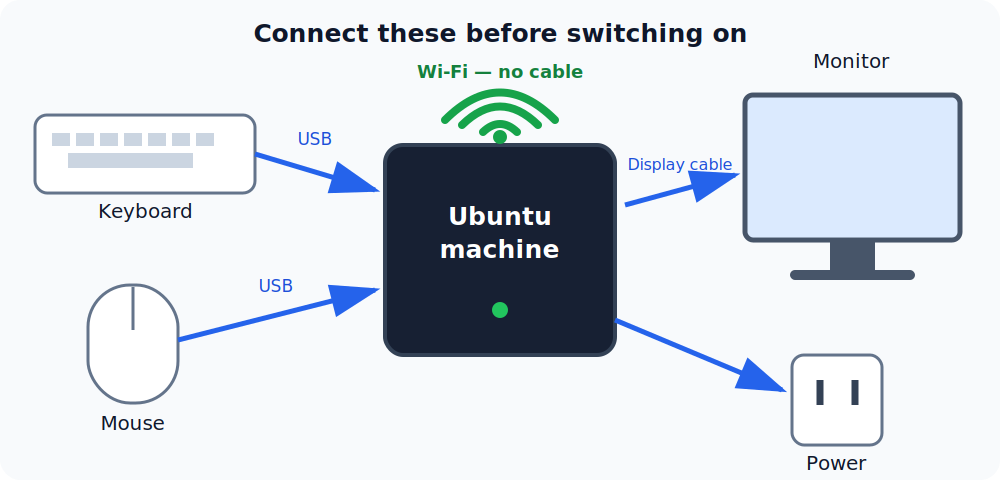
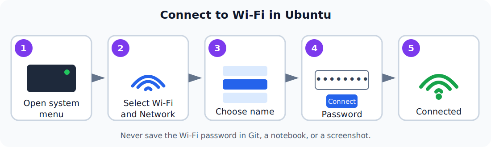
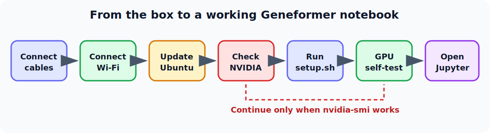

# Machine setup: cables to Geneformer

This tutorial is for a new Ubuntu workstation, including NVIDIA GB10 systems
such as the ASUS Ascent GX10 and Lenovo ThinkStation PGX. It starts with the
machine still in the box and ends with a tested Geneformer GPU environment.

> **Important:** Use the installation and recovery image supplied for your
> exact machine. GB10 appliances normally ship with a vendor-supported DGX OS
> image. Do not replace that image with generic Ubuntu or install a driver from
> an NVIDIA `.run` file unless the machine vendor explicitly instructs you to.

## Before you start

You need:

- the computer and its supplied power adapter or cable;
- a monitor and a compatible display cable;
- a USB keyboard and mouse (wired devices are easiest for first boot);
- the Wi-Fi network name and password;
- at least 50 GB free for the default model and environment;
- administrator (`sudo`) access; and
- about 30–60 minutes, plus download time.

Keep the machine on a hard, open surface. Do not cover its vents. With the
machine switched off, check the vendor quick-start sheet and identify the
power, display, USB, and power-button symbols.

## 1. Connect the wires

Connect the wired devices before switching on. The network connection is
wireless and is configured after Ubuntu starts.



*Figure 1 — Connect USB, display, and power cables. Wi-Fi is wireless, so no
network cable is needed.*

1. Connect the keyboard and mouse to USB ports. A small adapter is fine when a
   USB-A plug must connect to a USB-C port.
2. Connect the monitor to a display output on the computer, then select that
   input on the monitor. Do not connect the cable to a monitor input on another
   computer or dock by mistake.
3. Leave the network port empty; this tutorial uses Wi-Fi.
4. Connect the supplied power adapter to the computer and then to a grounded
   outlet or surge protector. Appliance power supplies can be model-specific;
   do not substitute one merely because its plug fits.
5. Turn on the monitor, then press the computer's power button once.

If there is no picture, wait one minute, confirm the monitor input, and reseat
the display cable. Avoid repeatedly removing power while a first boot or
firmware update is in progress.

## 2. Finish Ubuntu first boot

Follow the on-screen setup to select language, keyboard layout, time zone,
user name, and password. Record the password securely because it is needed for
`sudo` commands.

### Connect to Wi-Fi



*Figure 2 — The Ubuntu Wi-Fi connection sequence. Menu wording can vary
slightly between Ubuntu versions.*

1. Select the **system menu** in the upper-right corner of the Ubuntu desktop.
2. Select **Wi-Fi**, then **Select Network**.
3. Select your Wi-Fi network name (also called its SSID).
4. Enter the Wi-Fi password and select **Connect**.
5. Check that the Wi-Fi icon appears in the top bar.

If the network is hidden, choose **Connect to Hidden Network** and type its
exact name, security type, and password. Do not publish or add the Wi-Fi
password to this repository.

After the desktop appears, open **Terminal** with `Ctrl`+`Alt`+`T`. Commands in
this tutorial are entered one block at a time. A password prompt does not show
dots or characters while you type; that is normal.

Confirm the operating system, CPU architecture, internet, and free space:

```bash
cat /etc/os-release
uname -m
ping -c 3 ubuntu.com
df -h /
```

You can also confirm which Wi-Fi network is active:

```bash
nmcli -t -f active,ssid dev wifi | grep '^yes:'
```

The text after `yes:` should be your network name. If `ping` fails but Wi-Fi
shows connected, open a browser once: guest and institutional networks may
require a sign-in page. Keep the machine near the access point during the
large model download and prevent it from sleeping.

GB10 machines should normally report `aarch64`. A conventional Intel or AMD
workstation normally reports `x86_64`.

## 3. Update Ubuntu safely (please skip if the computer utilizes Ubuntu now)

Close other applications and save work, then install Ubuntu's available
updates:

```bash
sudo apt update
sudo apt full-upgrade
sudo apt autoremove
```

Read the package summary before answering `Y`. `autoremove` is optional; if it
proposes removing an NVIDIA or vendor package you do not recognize, answer
`N` and consult the vendor documentation.

Check for device firmware updates:

```bash
sudo fwupdmgr refresh
fwupdmgr get-updates
```

If updates are listed, use the graphical **Firmware** application or run:

```bash
sudo fwupdmgr update
```

Keep AC power connected throughout a firmware update. Reboot after operating
system, kernel, driver, or firmware updates:

```bash
sudo reboot
```

Once the machine returns, reopen Terminal and check that no package operation
was left incomplete:

```bash
sudo dpkg --audit
```

No output means the package database passed this check.

## 4. Verify or update the NVIDIA driver

First see whether the installed driver already works:

```bash
nvidia-smi
```

For a compact pass/fail check, run:

```bash
if command -v nvidia-smi >/dev/null && nvidia-smi >/dev/null 2>&1; then
  echo "NVIDIA driver: OK"
  nvidia-smi --query-gpu=name,driver_version --format=csv,noheader
else
  echo "NVIDIA driver: NOT READY"
fi
```

Continue only when this prints `NVIDIA driver: OK`. If it prints `NOT READY`,
use the appropriate driver instructions below before installing Geneformer.

A table containing the GPU name, driver version, and CUDA version means the
kernel driver is working. The CUDA version in this table is the newest CUDA
runtime supported by the driver; it does not mean the CUDA Toolkit is
installed, and this repository does not require a system-wide Toolkit.

### GB10 appliance (ASUS Ascent GX10 or Lenovo ThinkStation PGX)

Use the vendor-supported operating-system updater. In most cases the Ubuntu
update in the previous section is the correct path. Check the vendor support
page for BIOS, firmware, recovery-image, or release-specific instructions
before adding repositories or changing drivers.

Do **not** run `ubuntu-drivers install` on a working GB10 appliance merely to
obtain a numerically newer driver. The kernel, NVIDIA driver, CUDA components,
and appliance firmware are tested as a stack. After an approved update and
reboot, run `nvidia-smi` again.

### Standard Ubuntu workstation with a discrete NVIDIA GPU

If `nvidia-smi` is missing or reports that it cannot communicate with the
driver, ask Ubuntu which packaged driver it recommends:

```bash
sudo ubuntu-drivers list
sudo ubuntu-drivers install
sudo reboot
```

Then run `nvidia-smi` again. Prefer Ubuntu's signed packages over NVIDIA's
standalone `.run` installer. On Secure Boot systems, Ubuntu may ask you to
create and confirm a one-time Machine Owner Key during reboot; follow the
on-screen enrollment prompt or the driver will not load.

If `ubuntu-drivers` is unavailable, install its package first:

```bash
sudo apt install ubuntu-drivers-common
```

Stop here if `nvidia-smi` still fails. Record the output of these commands for
the vendor or administrator:

```bash
lspci | grep -i nvidia
uname -r
dkms status
journalctl -k -b | grep -iE 'nvidia|nouveau|secure boot'
```

Do not continue with the repository's `cu130` profile until `nvidia-smi`
works.

## 5. Install the repository prerequisites

Install Git and Git LFS from Ubuntu, then install `uv` for your user:

```bash
sudo apt update
sudo apt install git git-lfs curl
curl -LsSf https://astral.sh/uv/install.sh | sh
```

Close and reopen Terminal so its `PATH` includes `uv`, then verify everything:

```bash
git --version
git-lfs version
git lfs install
uv --version
```

Because the command above installs the standalone version of `uv`, it can
update itself without changing Ubuntu's system Python:

```bash
uv self update
uv --version
```

If `uv` was installed later through an operating-system package manager,
update it with that same package manager instead of `uv self update`.

The repository setup installs JupyterLab as an isolated, user-wide UV tool.
To install it before running the full Geneformer setup, or to repair it later:

```bash
./scripts/install_jupyterlab_tool.sh
jupyter-lab --version
```

This makes `jupyter-lab` available to the current user across projects without
changing Ubuntu's system Python. If the installer updates the shell `PATH`,
open a new terminal before invoking `jupyter-lab`.

## 6. Networking and remote access

Only enable remote-access software on machines where it is permitted by your
organization. Treat RustDesk passwords, Tailscale authentication links, and
device approval requests as secrets. Do not place them in Git or notebooks.

### Install tmux

`tmux` keeps a terminal job running when a remote connection closes:

```bash
sudo apt update
sudo apt install -y tmux
tmux new -s geneformer
```

Inside tmux, press `Ctrl`+`B`, release both keys, and press `D` to detach. Return
to the session later with:

```bash
tmux attach -t geneformer
```

Run long setup or analysis commands inside this session. JupyterLab can also
be started inside tmux, but its access token must still remain private.

### Install and enable RustDesk 1.4.9 on ARM64

The requested package is only for `aarch64`/ARM64 machines. Confirm the
architecture first:

```bash
uname -m
```

Continue with this package only if the output is `aarch64`. Download
`rustdesk-1.4.9-aarch64.deb` from the official RustDesk release source into
your `Downloads` folder. Then inspect and install that exact local file:

```bash
cd "$HOME/Downloads"
test -f rustdesk-1.4.9-aarch64.deb
dpkg-deb --info rustdesk-1.4.9-aarch64.deb | head
sudo apt install ./rustdesk-1.4.9-aarch64.deb
```

Enable the background service and verify it is active:

```bash
sudo systemctl enable --now rustdesk
systemctl is-enabled rustdesk
systemctl is-active rustdesk
sudo systemctl status rustdesk --no-pager
```

The two short checks should print `enabled` and `active`. Open the RustDesk
desktop application to review its ID, unattended-access policy, and password.
Use a unique strong password and restrict access to approved operators. If the
service does not start, inspect its current-boot log:

```bash
journalctl -u rustdesk -b --no-pager
```

### Install and connect Tailscale

Install Tailscale using its official installer, then join the machine to your
mesh network:

```bash
curl -fsSL https://tailscale.com/install.sh | sh
sudo tailscale up
```

Open the authentication URL printed by `tailscale up`, sign in to the correct
Tailscale account, and approve the device if your policy requires it. Verify
the connection:

```bash
systemctl is-active tailscaled
tailscale status
tailscale ip -4
```

Expect `tailscaled` to be `active`, the machine to appear in `tailscale
status`, and a Tailscale IPv4 address to be printed. Tailscale does not by
itself grant RustDesk access; configure each product's access controls and
your organization's firewall policy deliberately.

## 7. Download and set up Geneformer

The core path from a powered-off machine to a working notebook is:



*Figure 3 — Core setup flow. Do not proceed past the GPU check when
`nvidia-smi` fails.*

Choose a directory for projects, clone this repository, and run setup:

```bash
mkdir -p "$HOME/projects"
cd "$HOME/projects"
git clone https://github.com/Kays3/geneformer-uv-starter.git
cd geneformer-uv-starter
./setup.sh
```

On an ARM64 GB10 machine with a working NVIDIA driver, automatic detection
selects the CUDA 13.0 PyTorch profile. Other hardware uses the CPU profile.
The default setup downloads the Geneformer V2 104M checkpoint and may take
several minutes.

Setup creates and syncs `geneformer-workspace/analysis/uv.lock`. This is the
authoritative, exact environment lockfile. Check that it agrees with
`pyproject.toml`:

```bash
cd geneformer-workspace/analysis
uv lock --check
```

No output and exit status zero means the lockfile is current. Keep `uv.lock`
with the analysis project when moving it to version control.

Some tools expect a pip-style requirements file. Generate a compatibility
lock from the same project when needed:

```bash
uv pip compile pyproject.toml -o requirements.lock.txt
```

Review and keep `requirements.lock.txt` beside `pyproject.toml` if another
tool consumes it. It is an additional platform-specific export, not a
replacement for `uv.lock`, and no lockfile can make operating-system drivers
or hardware identical across machines.

Return to the starter repository before using its commands:

```bash
cd ../..
```

Verify the completed environment:

```bash
./start.sh check
```

For a GPU setup, confirm these fields in the report:

```json
{
  "cuda_available": true,
  "cuda_self_test": true,
  "gpu": "NVIDIA GB10"
}
```

The exact GPU name can differ on a standard workstation. The important result
is that both CUDA fields are `true`.

Start JupyterLab:

```bash
./start.sh
```

Open the local URL printed in Terminal and select
`notebooks/01_stage1_cell_type_tutorial.ipynb`. Only share a Jupyter token or
URL with people who should be able to run code on this machine.

## 8. Routine maintenance

Before updating, stop JupyterLab with `Ctrl`+`C` in its Terminal. Then update
Ubuntu and this starter separately:

```bash
sudo apt update
sudo apt full-upgrade
sudo reboot
```

After the reboot:

```bash
cd "$HOME/projects/geneformer-uv-starter"
git pull --ff-only
./setup.sh
./start.sh check
```

Keep personal notebooks and results under `geneformer-workspace/analysis/` and
back them up. Repository setup does not make a backup of the machine.

## Quick troubleshooting

| Symptom | First check |
| --- | --- |
| No display | Monitor power/input, display cable, and the computer's display output |
| Wi-Fi network is not listed | Move closer to the access point, toggle Wi-Fi off and on, and confirm airplane mode is off |
| Wi-Fi connects but internet fails | Open a browser for a possible sign-in page; then run `ping -c 3 ubuntu.com` |
| Download is slow or stops | Move closer to the access point, prevent sleep, and rerun `./setup.sh` |
| `sudo` rejects the password | Use the login password; typing is intentionally invisible |
| `uv: command not found` | Close and reopen Terminal, or follow the path message printed by the installer |
| RustDesk package will not install | Confirm `uname -m` is `aarch64` and the package is the ARM64 `.deb` |
| RustDesk is not active | Run `journalctl -u rustdesk -b --no-pager` and inspect the service error |
| Tailscale is not connected | Run `sudo tailscale up`, open its login URL, and check `tailscale status` |
| tmux session appears missing | Run `tmux ls`, then attach with the exact session name shown |
| `nvidia-smi` fails after an update | Reboot once; then use the diagnostics in section 4 |
| Setup chooses CPU on a GB10 | Make sure `uname -m` is `aarch64` and `nvidia-smi` reports a GPU containing `GB10` |
| CUDA smoke test fails | Do not reinstall random CUDA packages; confirm `nvidia-smi`, reboot, and use the supported driver path |
| Model download stops | Check free disk space and Wi-Fi, then rerun `./setup.sh` |

For the repository's profile and model options, workspace layout, dataset
details, and application-level troubleshooting, return to the
[main README](../README.md).
