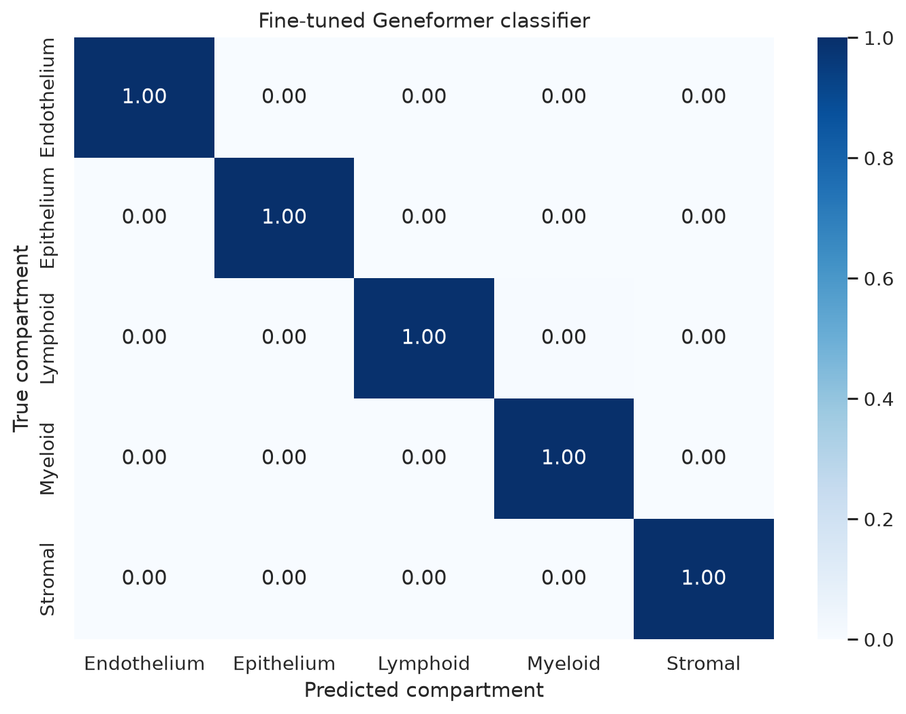
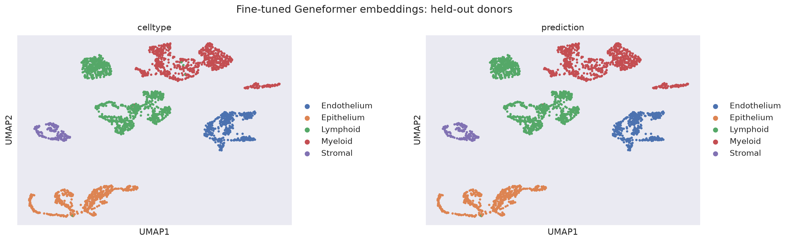

# Lung allograft classification results

This report records the completed donor-held-out comparison from
[`02_lung_allograft_classification_tutorial.ipynb`](../../../notebooks/02_lung_allograft_classification_tutorial.ipynb):

1. frozen pretrained Geneformer V2 104M cell embeddings with a class-balanced
   logistic-regression probe; and
2. a Geneformer cell-classification head with partial transformer fine-tuning.

The run completed on July 23, 2026. Fine-tuning was enabled, the saved model
was evaluated on the same two held-out donors as the frozen baseline, and all
16 executable notebook cells completed without error after the evaluation
metadata fix described below.

## Experiment summary

| Item | Value |
| --- | --- |
| Dataset | Human lung allograft biopsy atlas |
| CELLxGENE collection | [`e276e3e2-197a-4524-abd1-a753a48dc33a`](https://cellxgene.cziscience.com/collections/e276e3e2-197a-4524-abd1-a753a48dc33a) |
| Source cells × genes | 56,676 × 27,320 |
| Balanced tutorial cohort | 15,372 cells |
| Classification target | Five broad cell compartments |
| Training donors | `LTx_pt_01`, `LTx_pt_02`, `LTx_pt_03`, `LTx_pt_05`, `LTx_pt_07` |
| Model-selection donor | `LTx_pt_04` |
| Held-out test donors | `LTx_pt_06`, `LTx_pt_08` |
| Held-out test cells | 2,874 |
| Base model | Geneformer V2 104M |
| Frozen classifier | Standardized, class-balanced logistic regression |
| Fine-tuning | One epoch, first six transformer layers frozen |
| Fine-tuning steps | 1,267 |
| Learning rate | `5e-5` with scheduler decay |
| Train/evaluation batch size | 8 / 16 |
| Random seed | 42 |
| Validation machine | NVIDIA GB10, CUDA 13.0, PyTorch 2.13.0 |
| Validation date | 2026-07-23 |

Donors are disjoint across training, model-selection, and testing splits. Raw
integer counts were taken from `raw.X`; the normalized source `X` matrix was
not tokenized. The source H5AD matched the expected SHA-256 checksum in
[`datasets/lung_allograft.manifest.json`](../../../datasets/lung_allograft.manifest.json).

## Overall comparison

| Method | Accuracy | Macro F1 | Errors / 2,874 |
| --- | ---: | ---: | ---: |
| Frozen embeddings + logistic regression | 0.9976 | 0.9983 | 7 |
| Fine-tuned Geneformer classifier | **0.9983** | **0.9989** | **5** |

[Download the full-precision comparison](model_comparison.csv).

Fine-tuning increased accuracy by **0.000696**, or about **0.070 percentage
points**, and increased macro F1 by **0.000581**, or about **0.058 percentage
points**. The absolute change is two additional correct predictions, reducing
the error count from seven to five. Because the frozen baseline was already
near the performance ceiling, the practical gain on this split is small.

## Fine-tuned classification report

| Compartment | Precision | Recall | F1 | Support |
| --- | ---: | ---: | ---: | ---: |
| Endothelium | 1.0000 | 1.0000 | 1.0000 | 424 |
| Epithelium | 1.0000 | 1.0000 | 1.0000 | 535 |
| Lymphoid | 0.9990 | 0.9959 | 0.9974 | 966 |
| Myeloid | 0.9950 | 0.9988 | 0.9969 | 800 |
| Stromal | 1.0000 | 1.0000 | 1.0000 | 149 |
| **Macro average** | **0.9988** | **0.9989** | **0.9989** | **2,874** |
| **Weighted average** | **0.9983** | **0.9983** | **0.9983** | **2,874** |

[Download the full-precision fine-tuned classification report](finetuned_classification_report.csv).
The [frozen baseline classification report](baseline_classification_report.csv)
is retained for direct comparison.

## Fine-tuned confusion matrix

Rows are true compartments and columns are predictions. Values are normalized
within each true class.

| True \ Predicted | Endothelium | Epithelium | Lymphoid | Myeloid | Stromal |
| --- | ---: | ---: | ---: | ---: | ---: |
| Endothelium | **1.0000** | 0 | 0 | 0 | 0 |
| Epithelium | 0 | **1.0000** | 0 | 0 | 0 |
| Lymphoid | 0 | 0 | **0.9959** | 0.0041 | 0 |
| Myeloid | 0 | 0 | 0.0013 | **0.9988** | 0 |
| Stromal | 0 | 0 | 0 | 0 | **1.0000** |



[Download the full-precision fine-tuned matrix](finetuned_confusion_matrix_normalized.csv).

Fine-tuning made five errors: four Lymphoid cells were predicted as Myeloid,
and one Myeloid cell was predicted as Lymphoid. The frozen baseline made seven
errors, all on Lymphoid cells: two predicted as Epithelium and five as
Myeloid. The complete transition counts are in
[`misclassification_summary.csv`](misclassification_summary.csv).

## Performance by test donor

| Method | Test donor | Cells | Errors | Accuracy |
| --- | --- | ---: | ---: | ---: |
| Frozen embeddings + logistic regression | `LTx_pt_06` | 1,173 | 0 | 1.0000 |
| Fine-tuned Geneformer classifier | `LTx_pt_06` | 1,173 | 0 | 1.0000 |
| Frozen embeddings + logistic regression | `LTx_pt_08` | 1,701 | 7 | 0.9959 |
| Fine-tuned Geneformer classifier | `LTx_pt_08` | 1,701 | 5 | 0.9971 |

[Download the full-precision donor comparison](per_donor_comparison.csv).

Both methods were perfect on `LTx_pt_06`; every observed difference came from
`LTx_pt_08`. This concentration is important: the overall cell-level score
does not demonstrate a consistent improvement across independent donors.

## Embedding UMAPs

The pretrained embedding UMAP colors held-out cells by curated compartment and
frozen-probe prediction:


The fine-tuned embedding UMAP shows the same held-out cells after partial
transformer fine-tuning:



These UMAPs are qualitative and were fitted separately. Compare neighborhood
separation only; absolute coordinates, cluster distances, and axis directions
are not aligned and should not receive biological interpretation.

## Key findings

1. **Frozen Geneformer embeddings already separate the five broad
   compartments extremely well.** A linear probe reached 99.76% accuracy on
   donors excluded from training.
2. **Partial fine-tuning produced a measurable but small improvement.** It
   reduced errors from seven to five and raised accuracy to 99.83%.
3. **The improvement was not donor-wide.** Both methods were perfect on one
   test donor, and all errors and gains occurred on the other donor.
4. **Residual confusion is biologically adjacent at this label resolution.**
   Fine-tuned errors were only between the broad Lymphoid and Myeloid
   compartments.
5. **The task is close to saturated at the compartment level.** Future work is
   more informative at finer cell-type resolution, across additional donor
   folds, or on an external cohort than by optimizing this single split.

## Limitations

- **Only eight donors:** five train donors, one model-selection donor, and two
  test donors are insufficient to estimate population-level generalization.
- **One fixed split:** the comparison needs repeated donor-level
  cross-validation. Cell-level support must not be mistaken for 2,874
  independent patient samples.
- **No uncertainty interval:** no donor bootstrap or repeated-seed confidence
  interval was calculated; a two-cell difference may not be stable.
- **Broad labels:** five compartments are easier than fine cell-type or cell-
  state classification and do not measure rejection diagnosis, graft outcome,
  or any clinical endpoint.
- **Single source atlas:** train, validation, and test donors come from the same
  study, so study-specific preparation, sequencing, annotation, and batch
  signals may remain learnable despite donor separation.
- **Minimal tuning budget:** one epoch, one seed, one learning rate, and one
  freeze depth were assessed. No hyperparameter search or calibration analysis
  was performed.
- **Supervised comparison:** the frozen method is not zero-shot; its logistic
  probe learns compartment labels from training donors. Fine-tuning also uses
  supervised compartment labels.
- **Qualitative embeddings:** UMAP appearance does not independently validate
  prediction quality or establish biological trajectories.

## What was run and fixed

The local run performed checksum validation, cohort construction, donor-
disjoint sampling, raw-count conversion, tokenization, pretrained embedding
extraction, baseline fitting, one-epoch partial fine-tuning, held-out
evaluation, confusion matrices, and separate baseline/fine-tuned UMAPs.

During the first evaluation attempt, the tutorial requested `celltype` through
`predict_metadata`, but Geneformer's prepared test dataset does not retain that
column. True labels are already available through `label_ids`, so the workflow
was corrected to request only `cell_id` and `individual`. The saved checkpoint
was then reused; training was not repeated. The correction is included in the
tutorial notebook and its builder script.

## Storage locations

Compact, reviewable result tables and figures are committed in this directory:

```text
docs/results/lung-allograft/
```

Large or regenerable assets remain in the Git-ignored local workspace:

```text
geneformer-workspace/analysis/lung_allograft_classification/
├── data/              # verified 1.18 GB source H5AD
├── input_data/        # 307 MB balanced raw-count H5AD
├── tokenized_data/    # 270 MB Geneformer dataset and caches
├── results/           # 160 MB tables, figures, and embedding CSVs
└── runs/
    └── 260724_geneformer_cellClassifier_lung_allograft_compartments/
        └── ksplit1/   # 1.3 GB trained checkpoint and optimizer state
```

The checkpoint, raw atlas, prepared H5AD, tokenized dataset, and embedding CSVs
are intentionally not committed because they are large and reproducible from
the documented source and notebook. The trained `model.safetensors` file alone
is approximately 398 MiB, above GitHub's normal single-file limit.

## Reproduce

1. Run `./setup.sh` and `./start.sh`.
2. Open `02_lung_allograft_classification_tutorial.ipynb` in JupyterLab.
3. Run the frozen-embedding baseline top to bottom.
4. Set `RUN_FINE_TUNING=True` and execute the fine-tuning cells.
5. Keep the documented donor split unchanged for a direct comparison.

The source dataset identity and checksum are recorded in
[`datasets/lung_allograft.manifest.json`](../../../datasets/lung_allograft.manifest.json).
