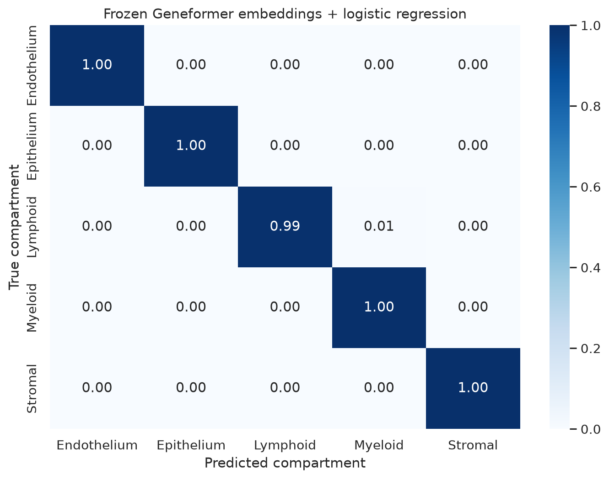
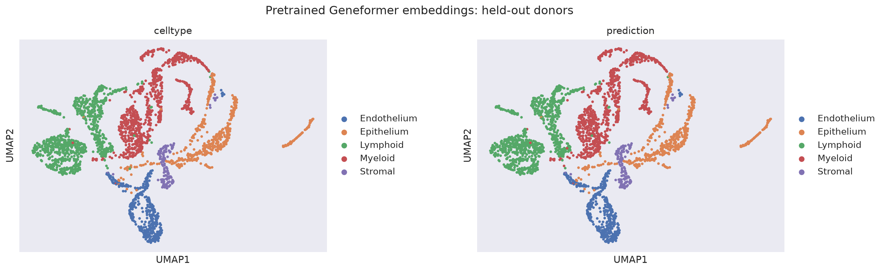

# Lung allograft classification results

This report records the validated **without transformer fine-tuning** baseline
from [`02_lung_allograft_classification_tutorial.ipynb`](../../../notebooks/02_lung_allograft_classification_tutorial.ipynb).
It uses frozen pretrained Geneformer V2 104M cell embeddings and trains only a
class-balanced logistic-regression probe.

> **Fine-tuning status:** not run. The tutorial includes the complete opt-in
> fine-tuning and evaluation workflow, but this page does not claim or display
> fine-tuned performance. Set `RUN_FINE_TUNING=True` in the notebook to produce
> that comparison.

## Experiment summary

| Item | Value |
| --- | --- |
| Dataset | Human lung allograft biopsy atlas |
| CELLxGENE collection | [`e276e3e2-197a-4524-abd1-a753a48dc33a`](https://cellxgene.cziscience.com/collections/e276e3e2-197a-4524-abd1-a753a48dc33a) |
| Source cells × genes | 56,676 × 27,320 |
| Balanced tutorial cohort | 15,372 cells |
| Classification target | Five broad cell compartments |
| Training donors | `LTx_pt_01`, `LTx_pt_02`, `LTx_pt_03`, `LTx_pt_05`, `LTx_pt_07` |
| Model-selection donor | `LTx_pt_04` |
| Held-out test donors | `LTx_pt_06`, `LTx_pt_08` |
| Held-out test cells | 2,874 |
| Feature model | Frozen Geneformer V2 104M |
| Classifier | Standardized, class-balanced logistic regression |
| Random seed | 42 |
| Validation machine | NVIDIA GB10, CUDA-enabled PyTorch |
| Validation date | 2026-07-24 |

Donors are disjoint across training, model-selection, and testing splits. Raw
integer counts were taken from `raw.X`; the normalized source `X` matrix was
not tokenized.

## Overall performance

| Method | Accuracy | Macro F1 | Test donors |
| --- | ---: | ---: | --- |
| Frozen embeddings + logistic regression | 0.9976 | 0.9983 | `LTx_pt_06`, `LTx_pt_08` |

These measurements describe this specific exploratory donor split. They are
not a clinical-performance estimate and should be followed by donor-level
cross-validation and external validation.

## Classification report

| Compartment | Precision | Recall | F1 | Support |
| --- | ---: | ---: | ---: | ---: |
| Endothelium | 1.0000 | 1.0000 | 1.0000 | 424 |
| Epithelium | 0.9963 | 1.0000 | 0.9981 | 535 |
| Lymphoid | 1.0000 | 0.9928 | 0.9964 | 966 |
| Myeloid | 0.9938 | 1.0000 | 0.9969 | 800 |
| Stromal | 1.0000 | 1.0000 | 1.0000 | 149 |
| **Macro average** | **0.9980** | **0.9986** | **0.9983** | **2,874** |
| **Weighted average** | **0.9976** | **0.9976** | **0.9976** | **2,874** |

[Download the full-precision classification report](baseline_classification_report.csv).

## Normalized confusion matrix

Rows are true compartments and columns are predictions. Values are normalized
within each true class.

| True \ Predicted | Endothelium | Epithelium | Lymphoid | Myeloid | Stromal |
| --- | ---: | ---: | ---: | ---: | ---: |
| Endothelium | **1.0000** | 0 | 0 | 0 | 0 |
| Epithelium | 0 | **1.0000** | 0 | 0 | 0 |
| Lymphoid | 0 | 0.0021 | **0.9928** | 0.0052 | 0 |
| Myeloid | 0 | 0 | 0 | **1.0000** | 0 |
| Stromal | 0 | 0 | 0 | 0 | **1.0000** |

[Download the full-precision normalized matrix](baseline_confusion_matrix_normalized.csv).

Seven of the 966 lymphoid test cells were misclassified: two as Epithelium and
five as Myeloid. All test cells in the other four compartments were classified
correctly.

## Held-out embedding UMAP

The left panel colors the pretrained Geneformer embedding by the curated true
compartment. The right panel colors the same points by logistic-regression
prediction.

The UMAP is qualitative. Visible separation is consistent with the
classification result but does not independently validate the classifier.
UMAP coordinates, cluster distances, and axis directions should not be given
direct biological interpretations.

## Reproduce or extend

1. Run `./setup.sh` and `./start.sh`.
2. Open `02_lung_allograft_classification_tutorial.ipynb` in JupyterLab.
3. Run the frozen-embedding baseline top to bottom.
4. To add fine-tuned results, set `RUN_FINE_TUNING=True`, execute the remaining
   cells, and retain the same held-out donors.

The source dataset identity and checksum are recorded in
[`datasets/lung_allograft.manifest.json`](../../../datasets/lung_allograft.manifest.json).
